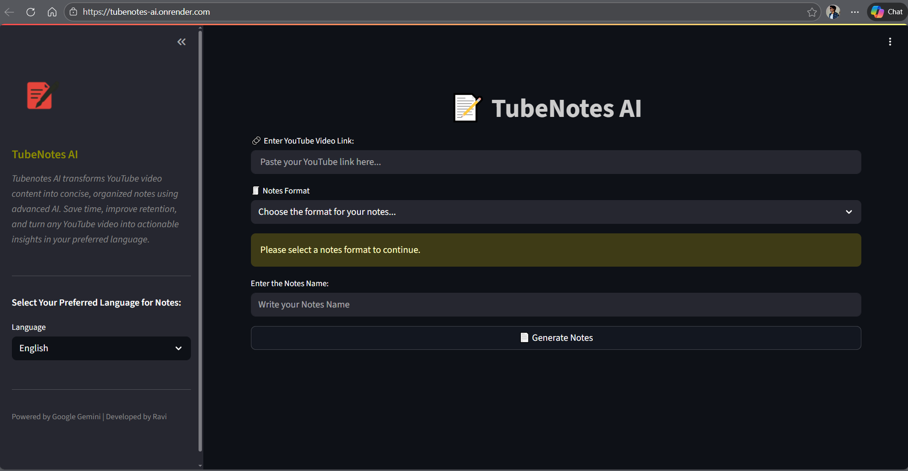
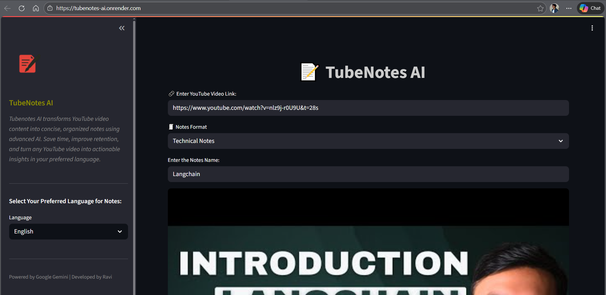
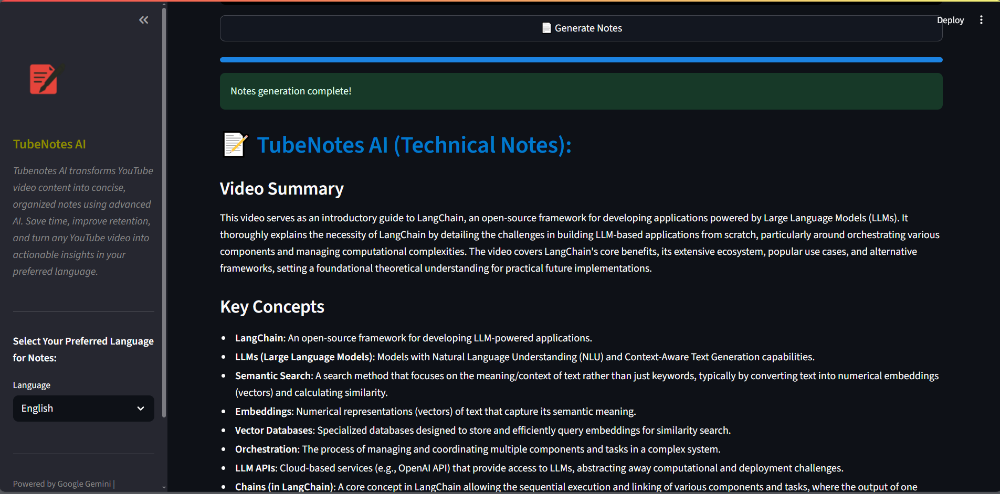
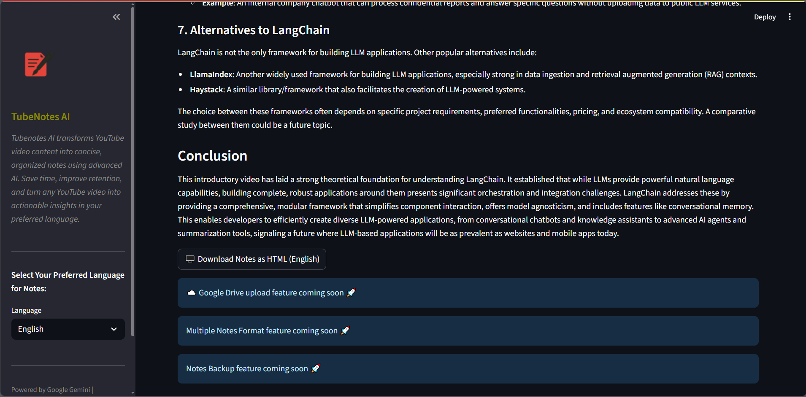

# TubeNotes AI

## Overview

TubeNotes AI is an intelligent tool that transforms YouTube video content into concise, actionable notes. Designed for technical, interview, and research topics, it leverages advanced AI (Google Gemini) to extract key insights, summaries, and Q&A from lengthy videos. Users can select their preferred language, customize note formats, and export notes as HTML for easy revision and sharing.

### User Interface




## 2. How TubeNotes AI Resolves the Problem

TubeNotes AI automatically converts YouTube video content into concise, organized notes using advanced AI (Google Gemini). It fetches video transcripts, applies structured prompts, and generates high-quality notes in various formats and languages. This enables users to quickly review, revise, and retain key insights from any video.

### Notes Format and Language selection



## 3. Advantages

- **Saves Time:** Instantly generates notes from any YouTube video.
- **Multiple Formats:** Supports technical notes, interview Q&A, and custom prompts.
- **Language Support:** Notes can be generated in multiple languages.
- **Downloadable:** Export notes as HTML for offline use or sharing.
- **User-Friendly:** Simple Streamlit interface for easy operation.


### Notes




## 4. Folder Structure

```
TubeNotes AI/
│
├── app.py                # Main Streamlit application
├── logo.png              # App logo
├── .env                  # Environment variables (API keys)
├── requirements.txt      # Python dependencies
├── assets/
│   ├── ui_demo.gif       # UI demonstration GIF
│   └── processed_notes_demo.gif  # Processed notes demonstration GIF
├── README.md             # Project documentation
└── (other files/folders as needed)
```

## 5. How to Use

1. **Clone the repository:**
   ```
   git clone https://github.com/yourusername/TubeNotes-AI.git
   cd TubeNotes-AI
   ```

2. **Install dependencies:**
   ```
   pip install -r requirements.txt
   ```

3. **Set up your `.env` file:**
   - Add your Google Gemini API key:
     ```
     GOOGLE_API_KEY=your_api_key_here
     ```

4. **Run the app:**
   ```
   streamlit run app.py
   ```

5. **Use the Interface:**
   - Enter a YouTube video link.
   - Select your preferred notes format (including custom prompt option).
   - Choose your desired export language (e.g., Spanish, Hindi, French, German, etc.).
   - Click "Generate Notes" to view the results.
   - Download the generated notes as an HTML file for offline use or sharing.


## Key Features

- **Language Selection:** Export notes in your preferred language, including Spanish, Hindi, French, German, and more.
- **Flexible Notes Format:** Choose from multiple predefined notes formats or use your own custom prompt for tailored note generation.
- **HTML Export:** Download generated notes as an HTML file for easy offline access or sharing.

### 📝 Download Notes in HTML



## 6. Conclusion

TubeNotes AI streamlines the process of learning from YouTube videos by transforming them into actionable, structured notes. It empowers users to save time, improve retention, and prepare effectively for technical interviews, research, or general study.

## 7. License

This project is licensed under the [MIT License](LICENSE).